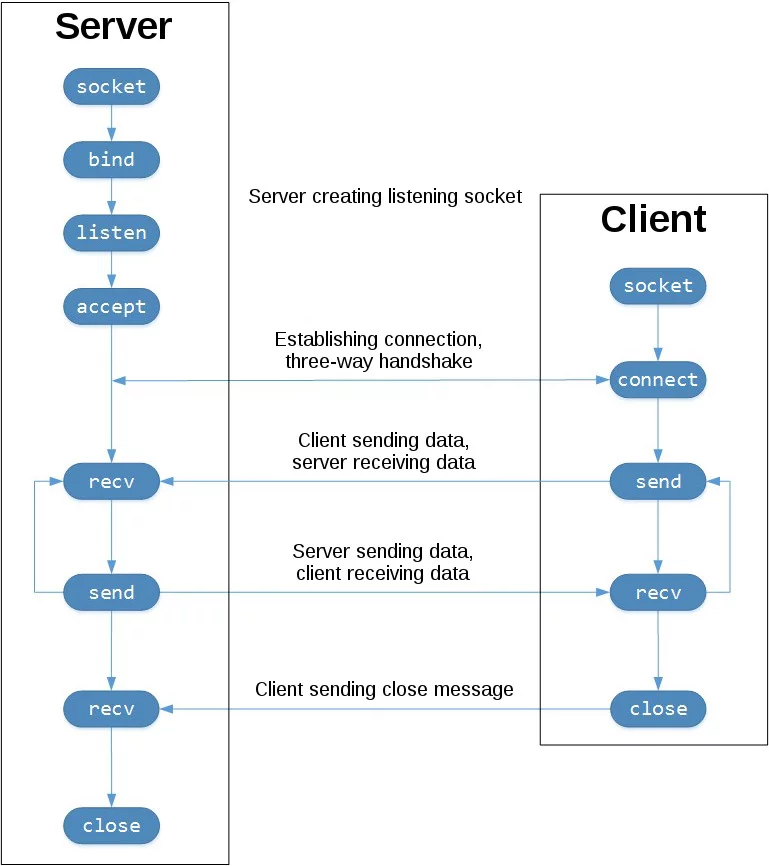

<!----- Conversion time: 1.019 seconds.

Using this Markdown file:

1. Cut and paste this output into your source file.
2. See the notes and action items below regarding this conversion run.
3. Check the rendered output (headings, lists, code blocks, tables) for proper
   formatting and use a linkchecker before you publish this page.

Conversion notes:

* Docs to Markdown version 1.0β17
* Wed Sep 18 2019 01:22:59 GMT-0700 (PDT)
* Source doc: https://docs.google.com/open?id=13Bwj-zrzPHWxDyeuZUzSwTNSqtZj9FI-spwD9tnhUTA
----->

# Простейшие TCP live stream video server и client

## Цель работы

Познакомиться с приемами работы с сетевыми сокетами в языке программирования Python.

## Задания для выполнения

Сегодня Мы собираемся вещать потоковое видео, используя программирование сокетов и OpenCV в Python. Мы получим видеопоток от хоста от веб -камеры, а затем отправим его клиенту. Таким образом, установим подключение между сервером и клиентом.

Программирование сокета:
-------------------

Во -первых, что такое **сокет** ? Сокеты позволяют общаться между двумя разными процессами на одних и тех же или разных машинах, точнее, это способ общаться с другими компьютерами, используя стандартные файловые дескрипторы Unix. Здесь сокет работает так же, как дескриптор файла низкого уровня,  такие команды, как read () и write (), работают с сокеты так же, как и с файлами и устройствами.

**Программирование сокета** это способ подключения двух узлов в сети для общения друг с другом. Один (узел) прослушивает конкретный порт по IP, в то время как другой узел обращается к другому, чтобы сформировать соединение.Сервер формирует сокет слушателя, пока клиент обращается к серверу.

Создание сервера:
-----------------------------

Мы создадим сокет, получим имя хоста, IP -хост и выведим их в консоль, чтобы проверить:

    # Importing the libraries
    import socket, cv2, pickle, struct, imutils
    # Create Socket
    server_socket = socket.socket(socket.AF_INET,socket.SOCK_STREAM)
    host_name  = socket.gethostname()
    host_ip = socket.gethostbyname(host_name)
    print('HOST IP:',host_ip)
    port = 9999
    socket_address = (host_ip,port)
    

Здесь мы сделали экземпляр сокета и передали ему два параметра. Первый параметр - AF\_INET, а второй - SOCK\_STREAM. AF\_INET относится к адресам IPv4. SOCK\_STREAM означает, ориентированный на соединение по TCP протоколу.

**bind() method**: Сервер имеет метод bind (), который связывает его с определенным IP и портом, чтобы он мог прослушать входящие запросы по этому IP и порту.

**listen() method**: Сервер имеет метод прослушивания (), который переводит сервер в режим прослушивания.

    # Socket Bind
    server_socket.bind(socket_address)
    # Socket Listen
    server_socket.listen(5) //5 here means that 5 connections are kept waiting if the server is busy and if a 6th socket trys to connect then the connection is refused.
    
    print("LISTENING AT:",socket_address)
    

**imutils.resize()** :-Функция изменения размера imutils сохраняет соотношение сторон и обеспечивает ширину и высоту аргументов ключевого слова, чтобы изображение можно было изменить до предполагаемой ширины/высоты при сохранении соотношения сторон и гарантирования размеров изображения не должно быть явно рассчитано разработчиком..

**pickle.dump()** :-Метод дампа () модуль в Python преобразует объект Python в байтовый поток.

**struct.pack ()** :-Он используется для упаковки элементов в байтовую строку на питоне (байтовый объект).

    # Socket Accept
    while True:
        client_socket,addr = server_socket.accept()
        print('GOT CONNECTION FROM:',addr)
        if client_socket:
            vid = cv2.VideoCapture(0)
            while(vid.isOpened()):
                img,frame = vid.read()
                frame = imutils.resize(frame,width=320)
                a = pickle.dumps(frame)
                message = struct.pack("Q",len(a))+a
                client_socket.sendall(message)
    
                cv2.imshow('TRANSMITTING VIDEO',frame)
                key = cv2.waitKey(1) & 0xFF
                if key ==ord('q'):
                    client_socket.close()
                    break
    cv2.destroyAllWindows()
    

# Создание клиента:

Как мы делали на стороне сервера, всё тоже самое и здесь:

    import socket, cv2, pickle, struct
    # create socket
    client_socket = socket.socket(socket.AF_INET,socket.SOCK_STREAM)
    host_ip = '192.168.56.1' #IP Address of Host to be Entered 
    port = 9999
    client_socket.connect((host_ip,port))
    data = b""
    payload_size = struct.calcsize("Q")
    

После подключения к хосту мы распаковываем полученное сообщение. Байтовый поток pickled-объекта Python может преобразовать обратно в объект Python, используя метод Pickle.load ().

    while True:
        while len(data) < payload_size:
            packet = client_socket.recv(4*1024) 
            if not packet: break
            data+=packet
        packed_msg_size = data[:payload_size]
        data = data[payload_size:]
        msg_size = struct.unpack("Q",packed_msg_size)[0]
        while len(data) < msg_size:
            data += client_socket.recv(4*1024)
        frame_data = data[:msg_size]
        data  = data[msg_size:]
        frame = pickle.loads(frame_data)
        cv2.imshow("RECEIVING VIDEO",frame)
        key = cv2.waitKey(1) & 0xFF
        if key  == ord('q'):
            break
    client_socket.close()
    cv2.destroyAllWindows()
    

Таким образом, мы написали код как клиентской стороны, так и хоста. Сначала мы запустим  код хоста, который переведет хост в режиме прослушивания, а затем запустим код клиента, и клиент установит соединение.
